<h2>Tensorflow-Image-Segmentation-Augmented-ALCAPA (2025/02/15)</h2>

Sarah T. Arai  
Software Laboratory antillia.com  
This is the first experiment of Image Segmentation for <b>ALCAPA (Anomalous Left Coronary Artery from Pulmonary Artery)</b>
 based on 
the latest <a href="https://github.com/sarah-antillia/Tensorflow-Image-Segmentation-API">Tensorflow-Image-Segmentation-API</a>, and
<a href="https://drive.google.com/file/d/1JP6hPC7ziBDiFX0LuMMAuLeP3xR5lhWT/view?usp=sharing">
ALCAPA-ImageMask-Dataset.zip</a>, which was derived by us from the dataset ImageALCAPA_BIBM_Publish.change2zip
in 
<a href="https://www.kaggle.com/datasets/xiaoweixumedicalai/imagealcapa"><b>ImageALCAPA
</b> 
</a>
 
 
<b>Data Augmentation Strategy:</b> 
 To address the limited size of ImageALCAPA dataset, 
 we employed <a href="./src/ImageMaskAugmentor.py">an online augmentation tool</a> to augment the dataset, which supports the following augmentation methods.
<li>Vertical flip</li>
<li>Horizontal flip</li>
<li>Rotation</li>
<li>Shrinks</li>
<li>Shears</li> 
<li>Deformation</li>
<li>Distortion</li>
<li>Barrel distortion</li>
<li>Pincushion distortion</li>
 
Please see also the following tools  
<li><a href="https://github.com/sarah-antillia/Image-Deformation-Tool">Image-Deformation-Tool</a></li>
<li><a href="https://github.com/sarah-antillia/Image-Distortion-Tool">Image-Distortion-Tool</a></li>
<li><a href="https://github.com/sarah-antillia/Barrel-Image-Distortion-Tool">Barrel-Image-Distortion-Tool</a></li>

 

<b>Actual Image Segmentation for Images of 512x512 pixels</b> 
As shown below, the inferred masks look similar to the ground truth masks.  

<table>
<tr>
<th>Input: image</th>
<th>Mask (ground_truth)</th>
<th>Prediction: inferred_mask</th>
</tr>
<tr>
<td>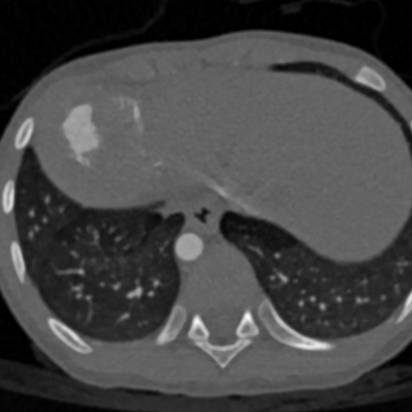</td>
<td></td>
<td></td>
</tr>

<tr>
<td>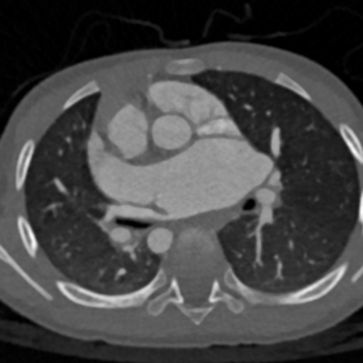</td>
<td></td>
<td></td>
</tr>

<tr>
<td>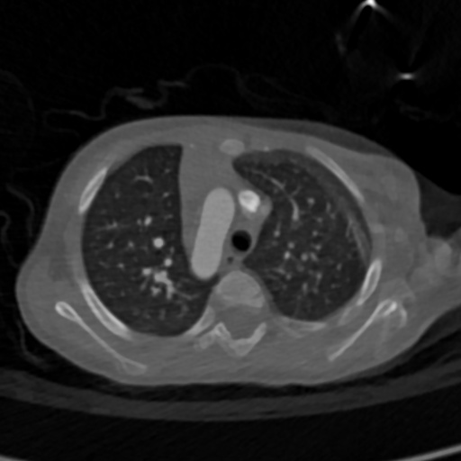</td>
<td>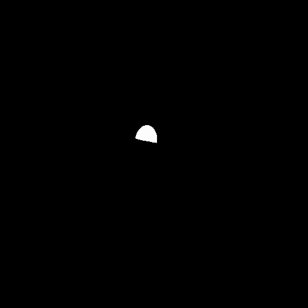</td>
<td>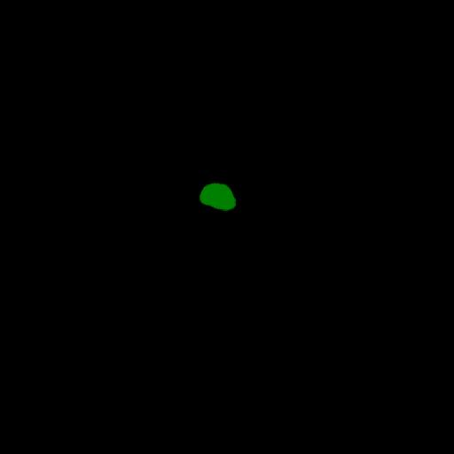</td>
</tr>

</table>

 
In this experiment, we used the simple UNet Model 
<a href="./src/TensorflowUNet.py">TensorflowSlightlyFlexibleUNet</a> for this ALCAPA Segmentation Model. 
As shown in <a href="https://github.com/sarah-antillia/Tensorflow-Image-Segmentation-API">Tensorflow-Image-Segmentation-API</a>.
you may try other Tensorflow UNet Models: 

<li><a href="./src/TensorflowSwinUNet.py">TensorflowSwinUNet.py</a></li>
<li><a href="./src/TensorflowMultiResUNet.py">TensorflowMultiResUNet.py</a></li>
<li><a href="./src/TensorflowAttentionUNet.py">TensorflowAttentionUNet.py</a></li>
<li><a href="./src/TensorflowEfficientUNet.py">TensorflowEfficientUNet.py</a></li>
<li><a href="./src/TensorflowUNet3Plus.py">TensorflowUNet3Plus.py</a></li>
<li><a href="./src/TensorflowDeepLabV3Plus.py">TensorflowDeepLabV3Plus.py</a></li>

 

<h3>1. Dataset Citation</h3>
The dataset used here has been taken from <b>ImageALCAPA_BIBM_Publish.change2zip</b> in the kaggle website 

<a href="https://www.kaggle.com/datasets/xiaoweixumedicalai/imagealcapa"><b>ImageALCAPA
</b> 
</a>
  
<b>About Dataset</b> 

The ImageALCAPA dataset totally consists of 30 3D CTA images gathered from Guangdong Provincial Peoples’ Hospital from June 17, 2016, 
to August 8, 2021. These images are acquired by a SOMATOM Definition Flash CT machine.
All the images are pre-operative ALCAPA CTA images whose top and bottom are around the neck and the brachiocephalic vessels, 
respectively, in the axial view. The segmentation labeling is performed by a team of two cardiovascular radiologists
 who have extensive experience in ALCAPA. For each image, one radiologist fulfills the labelling while the other verifies 
 it afterwards. The segmentation includes seven substructures: Myo, LV, RV, PA, Ao, LCA, and RCA, and the 
 labelling of each image goes by 1-1.5 hours.
 
 
Please see also: 
<a href="https://ieeexplore.ieee.org/document/9994951">
<b>ImageALCAPA: A 3D Computed Tomography Image Dataset for Automatic Segmentation of Anomalous Left Coronary Artery from Pulmonary Artery
</b></a>  
<b>License</b> 
<a href="https://www.apache.org/licenses/LICENSE-2.0">Apache 2.0</a>
 
 

<h3>
<a id="2">
2 ALCAPA ImageMask Dataset
</a>
</h3>
 If you would like to train this ALCAPA Segmentation model by yourself,
 please download our 512x512 pixels JPG dataset from the google drive 
<a href="https://drive.google.com/file/d/1JP6hPC7ziBDiFX0LuMMAuLeP3xR5lhWT/view?usp=sharing">
ALCAPA-ImageMask-Dataset.zip</a>
, expand the downloaded ImageMaskDataset and put it under <b>./dataset</b> folder to be
<pre>
./dataset
└─ALCAPA
    ├─test
    │   ├─images
    │   └─masks
    ├─train
    │   ├─images
    │   └─masks
    └─valid
        ├─images
        └─masks
</pre>
On the derivation of this ImageMask Dataset, please refer to the following Python scripts. 
<li><a href="./generator/ImageMaskDatasetGenerator.py">ImageMaskDatasetGenerator.py</a></li>
<li><a href="./generator/split_master.py">split_master.py</a></li>
 
 
<b>ALCAPA Dataset Statistics</b> 
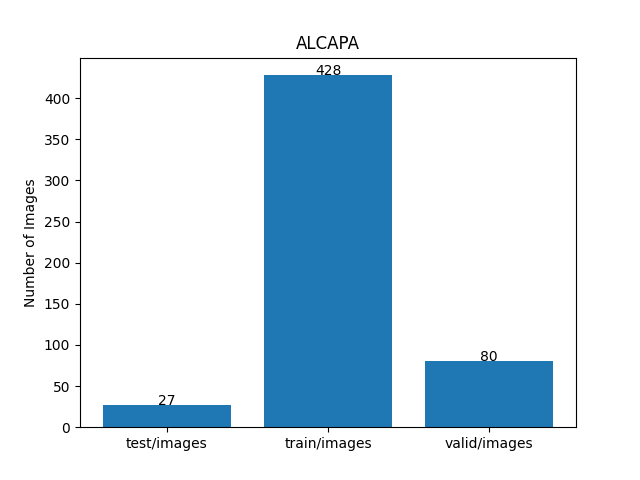 
 
As shown above, the number of images of train and valid datasets is not large enough to use for a training set 
of our segmentation model.
Therefore we used an online augmentation tool <a href="./src/ImageMaskAugmentor.py">ImageMaskAugmentor.py</a> 
to improve generalization performance.
 

 
<b>Train_images_sample</b> 
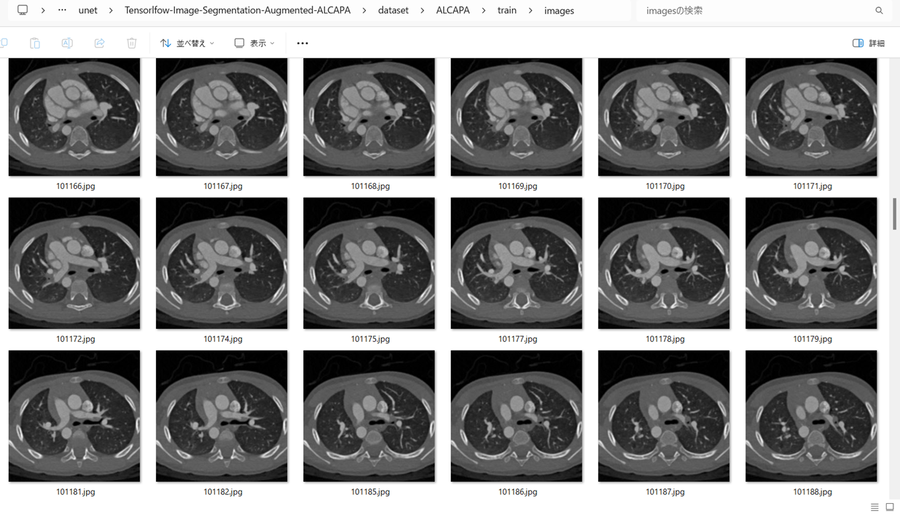
 
<b>Train_masks_sample</b> 
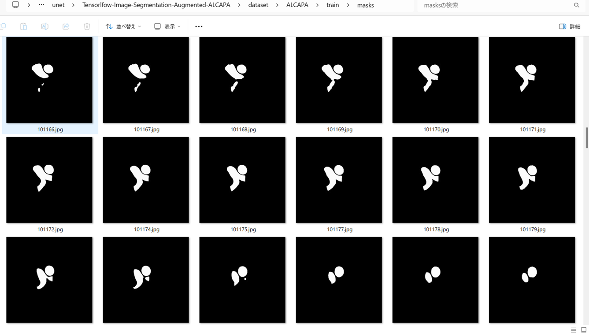
 

<h3>
3 Train TensorflowUNet Model
</h3>
 We have trained ALCAPATensorflowUNet Model by using the following
<a href="./projects/TensorflowSlightlyFlexibleUNet/ALCAPA/train_eval_infer.config"> <b>train_eval_infer.config</b></a> file.  
Please move to ./projects/TensorflowSlightlyFlexibleUNet/ALCAPA and run the following bat file. 
<pre>
>1.train.bat
</pre>
, which simply runs the following command. 
<pre>
>python ../../../src/TensorflowUNetTrainer.py ./train_eval_infer.config
</pre>

<b>Model parameters</b> 
Defined a small <b>base_filters</b> and large <b>base_kernels</b> for the first Conv Layer of Encoder Block of 
<a href="./src/TensorflowUNet.py">TensorflowUNet.py</a> 
and a large num_layers (including a bridge between Encoder and Decoder Blocks).
<pre>
[model]
base_filters   = 16
base_kernels   = (9,9)
num_layers     = 8
</pre>

<b>Learning rate</b> 
Defined a small learning rate.  
<pre>
[model]
learning_rate  = 0.0001
</pre>

<b>Online augmentation</b> 
Enabled our online augmentation tool.  
<pre>
[model]
model         = "TensorflowUNet"
generator     = True
</pre>

<b>Loss and metrics functions</b> 
Specified "bce_dice_loss" and "dice_coef". 
<pre>
[model]
loss           = "bce_dice_loss"
metrics        = ["dice_coef"]
</pre>
<b>Learning rate reducer callback</b> 
Enabled learing_rate_reducer callback, and a small reducer_patience.
<pre> 
[train]
learning_rate_reducer = True
reducer_factor     = 0.3
reducer_patience   = 4
</pre>

<b>Early stopping callback</b> 
Enabled early stopping callback with patience parameter.
<pre>
[train]
patience      = 10
</pre>

<b>Epoch change inference callbacks</b> 
Enabled epoch_change_infer callback. 
<pre>
[train]
epoch_change_infer       = True
epoch_change_infer_dir   =  "./epoch_change_infer"
epoch_changeinfer        = False
epoch_changeinfer_dir    = "./epoch_changeinfer"
num_infer_images         = 6
</pre>

By using this callback, on every epoch_change, the inference procedure can be called
 for an image in <b>mini_test</b> folder. This will help you confirm how the predicted mask changes 
 at each epoch during your training process.    

<b>Epoch_change_inference output at starting (1,2,3)</b> 
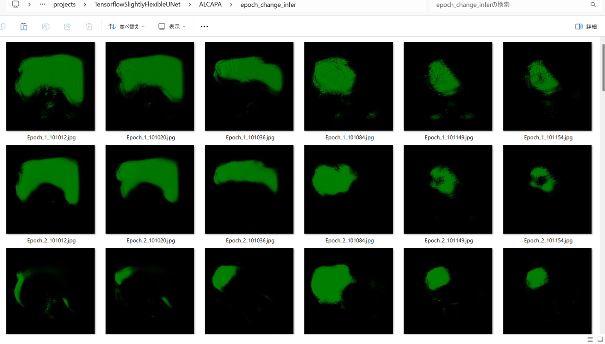 
 
 
<b>Epoch_change_inference output at ending (55,56,57)</b> 
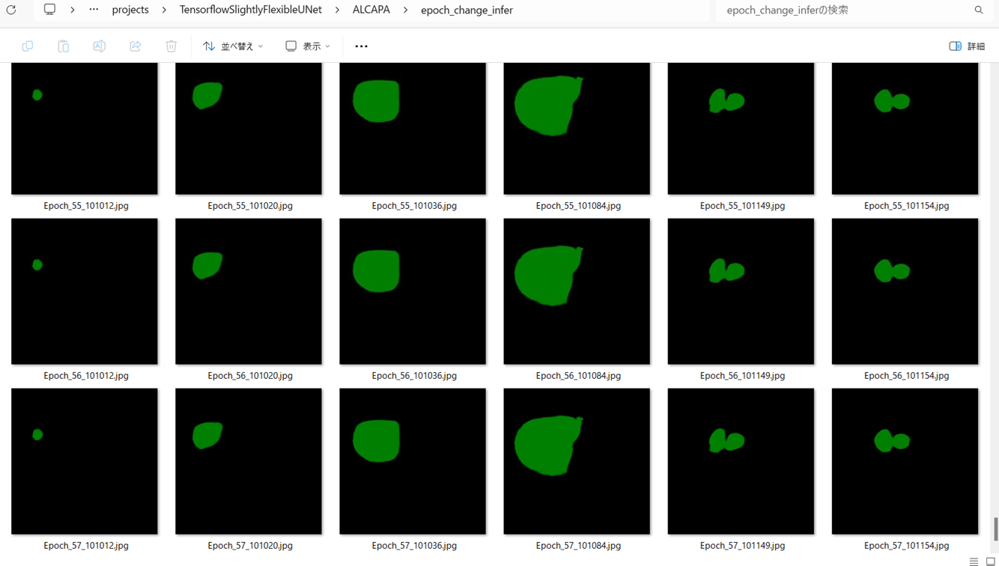 
 
 
In this experiment, the training process was stopped at epoch 57 by EarlyStopping Callback.  
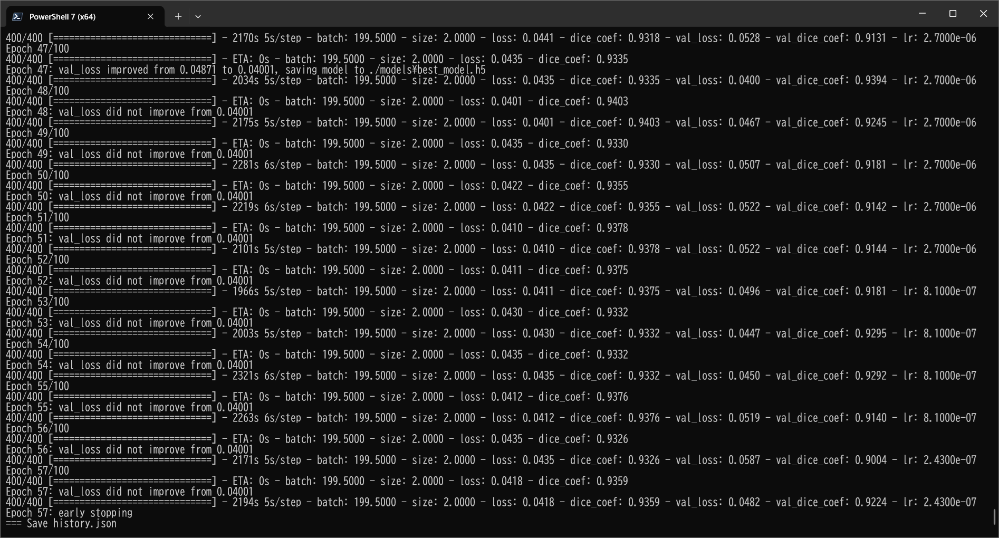 
 

 
<a href="./projects/TensorflowSlightlyFlexibleUNet/ALCAPA/eval/train_metrics.csv">train_metrics.csv</a> 
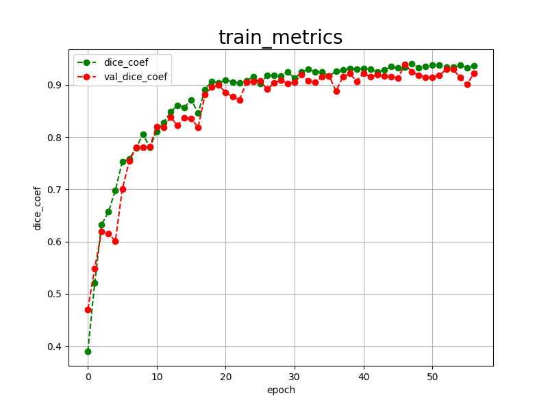 

 
<a href="./projects/TensorflowSlightlyFlexibleUNet/ALCAPA/eval/train_losses.csv">train_losses.csv</a> 
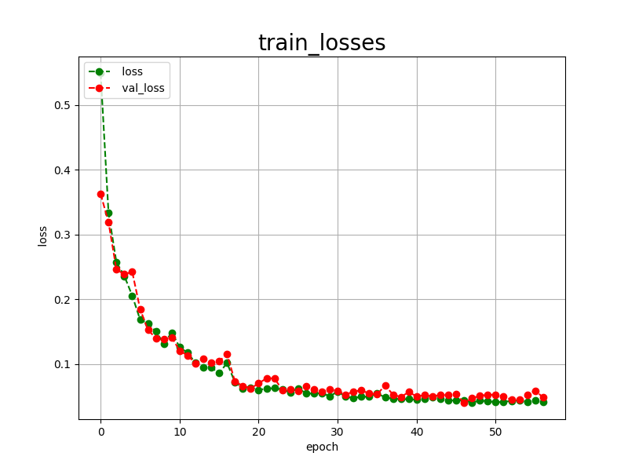 

 

<h3>
4 Evaluation
</h3>
Please move to a <b>./projects/TensorflowSlightlyFlexibleUNet/ALCAPA</b> folder, 
and run the following bat file to evaluate TensorflowUNet model for ALCAPA. 
<pre>
./2.evaluate.bat
</pre>
This bat file simply runs the following command.
<pre>
python ../../../src/TensorflowUNetEvaluator.py ./train_eval_infer_aug.config
</pre>

Evaluation console output: 
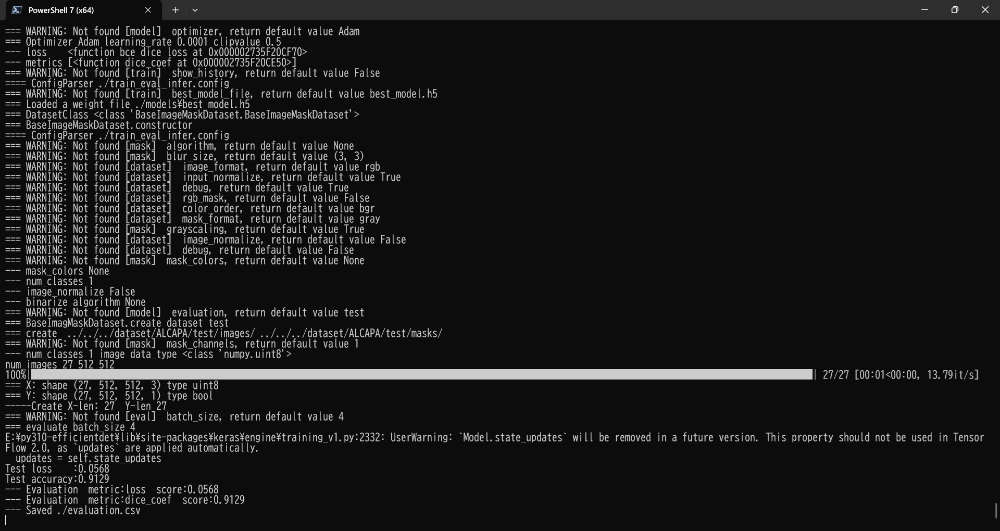
  

<a href="./projects/TensorflowSlightlyFlexibleUNet/ALCAPA/evaluation.csv">evaluation.csv</a> 

The loss (bce_dice_loss) to this ALCAPA/test was low, and dice_coef high as shown below.
 
<pre>
loss,0.0568
dice_coef,0.9129
</pre>
 
<h3>
5 Inference
</h3>
Please move to a <b>./projects/TensorflowSlightlyFlexibleUNet/ALCAPA</b> folder 
,and run the following bat file to infer segmentation regions for images by the Trained-TensorflowUNet model for ALCAPA. 
<pre>
./3.infer.bat
</pre>
This simply runs the following command.
<pre>
python ../../../src/TensorflowUNetInferencer.py ./train_eval_infer_aug.config
</pre>

<b>mini_test_images (512x512 pixels)</b> 
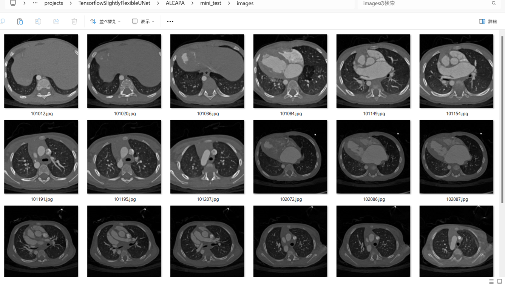 
<b>mini_test_mask(ground_truth)</b> 
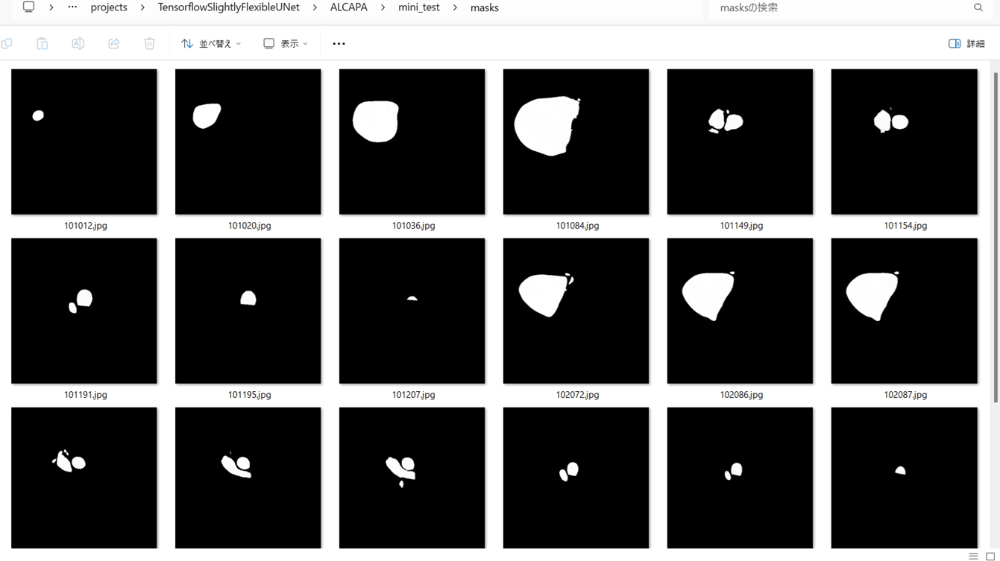 

<b>Inferred test masks</b> 
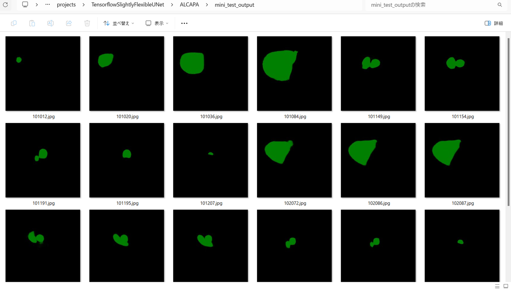 
 

<b>Enlarged images and masks (512x512 pixels) </b> 

<table>
<tr>
<th>Image</th>
<th>Mask (ground_truth)</th>
<th>Inferred-mask</th>
</tr>

<tr>
<td>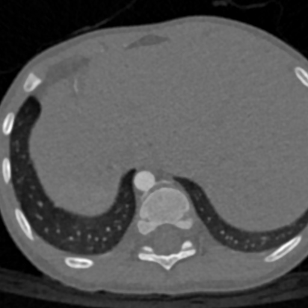</td>
<td></td>
<td></td>
</tr>

<tr>
<td>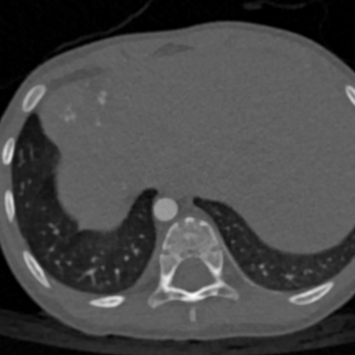</td>
<td></td>
<td></td>
</tr>

<tr>
<td>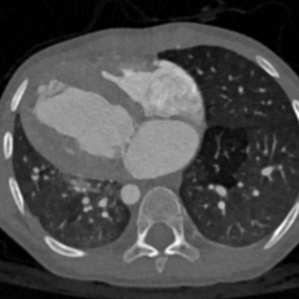</td>
<td>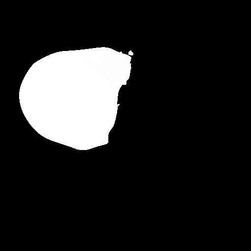</td>
<td>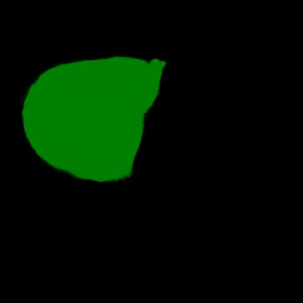</td>
</tr>
<tr>
<td></td>
<td></td>
<td></td>
</tr>
<tr>
<td>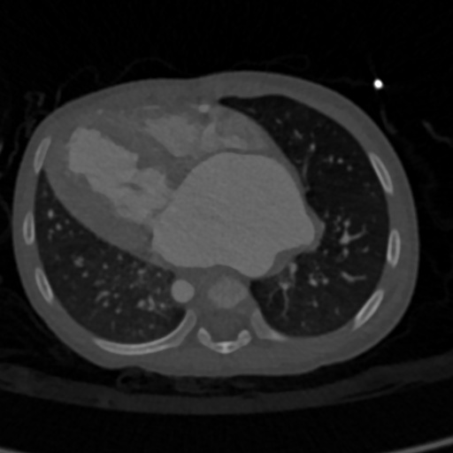</td>
<td>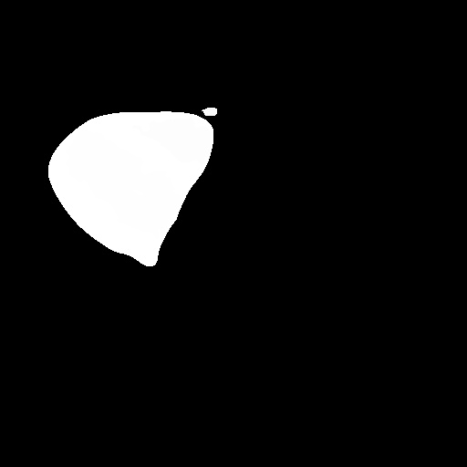</td>
<td></td>
</tr>
<tr>
<td>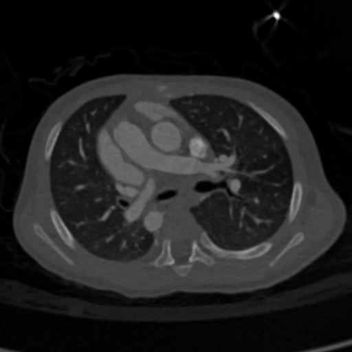</td>
<td></td>
<td></td>
</tr>

</table>

 
<h3>
References
</h3>
<b>1. ImageALCAPA: A 3D Computed Tomography Image Dataset for Automatic Segmentation of  
Anomalous Left Coronary Artery from Pulmonary Artery
</b> 
A. Zeng, C. Mi, D. Pan, Q. Lu and X. Xu,  
2022 IEEE International Conference on Bioinformatics and Biomedicine (BIBM),  
Las Vegas, NV, USA, 2022, pp. 1800-1803,  
doi: 10.1109/BIBM55620.2022.9994951. 
<a href="https://ieeexplore.ieee.org/document/9994951">
https://ieeexplore.ieee.org/document/9994951
</a>
 
 
<b>2. Anomalous Left Coronary Artery From the Pulmonary Artery</b> 
<a href="https://www.chop.edu/conditions-diseases/anomalous-left-coronary-artery-pulmonary-artery">
https://www.chop.edu/conditions-diseases/anomalous-left-coronary-artery-pulmonary-artery</a>
 
 

